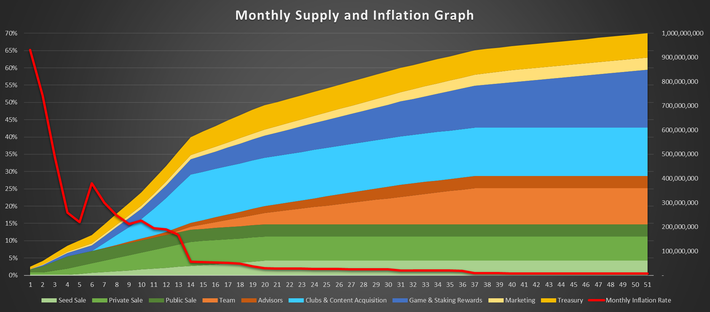

# Tokenomics

HUB token is the native token of the Scouthub game, which complies with the BEP20 token standards. Its utilities are:

* In-game purchases
* Marketplace token
* Staking & Rewards
* Participation in DAO votes
* Bridge with fan tokens

We are providing a utility for fan token holders as well. Both clubs and fans of those clubs will have privileges in Scouthub with their fan tokens.&#x20;

HUB token will be launched on Binance Smart Chain (BSC) network and the total supply will be 1,000,000,000 HUB.&#x20;

### Vesting Details

.png>)

### Allocation

.png>)

### Monthly Supply and Inflation

### Annual Supply and Inflation

.png>)
